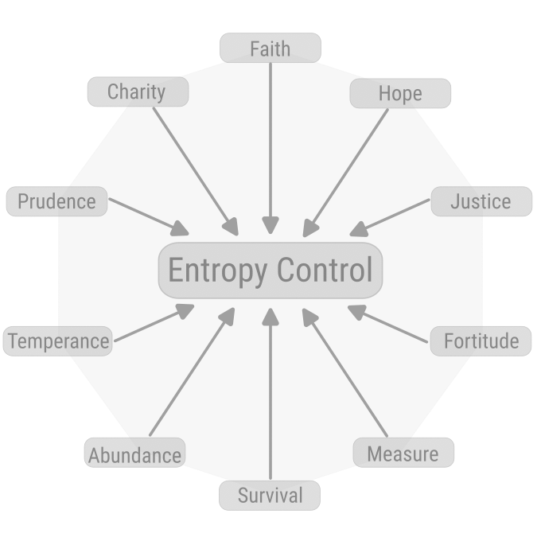

[back](./)

# Reduction of Virtues to 1 Concept

# Entropy Control

Ability to contain the natural tendency towards dispersal of energy together with the ability to redirect, postpone, or change the quality of the contained energy.

## The Influences

#### Provable Order/Hierarchy

### Faith, Reason

#### Economy

### Charity

#### Provable Goodness

### Hope

#### Harmony, Generosity

### Prudence

#### Forgiveness

### Justice

#### Governance

### Temperance

#### Fairness

### Fortitude

#### Competition

### Measurability

#### Market

### Abundance

#### Industriousness

### Survival