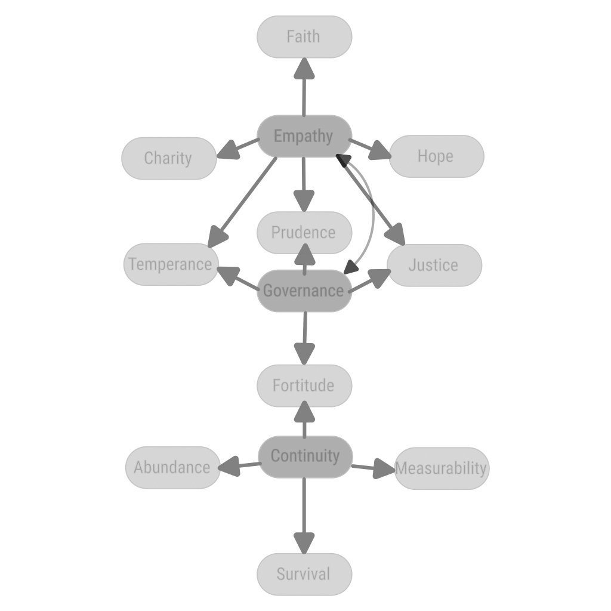
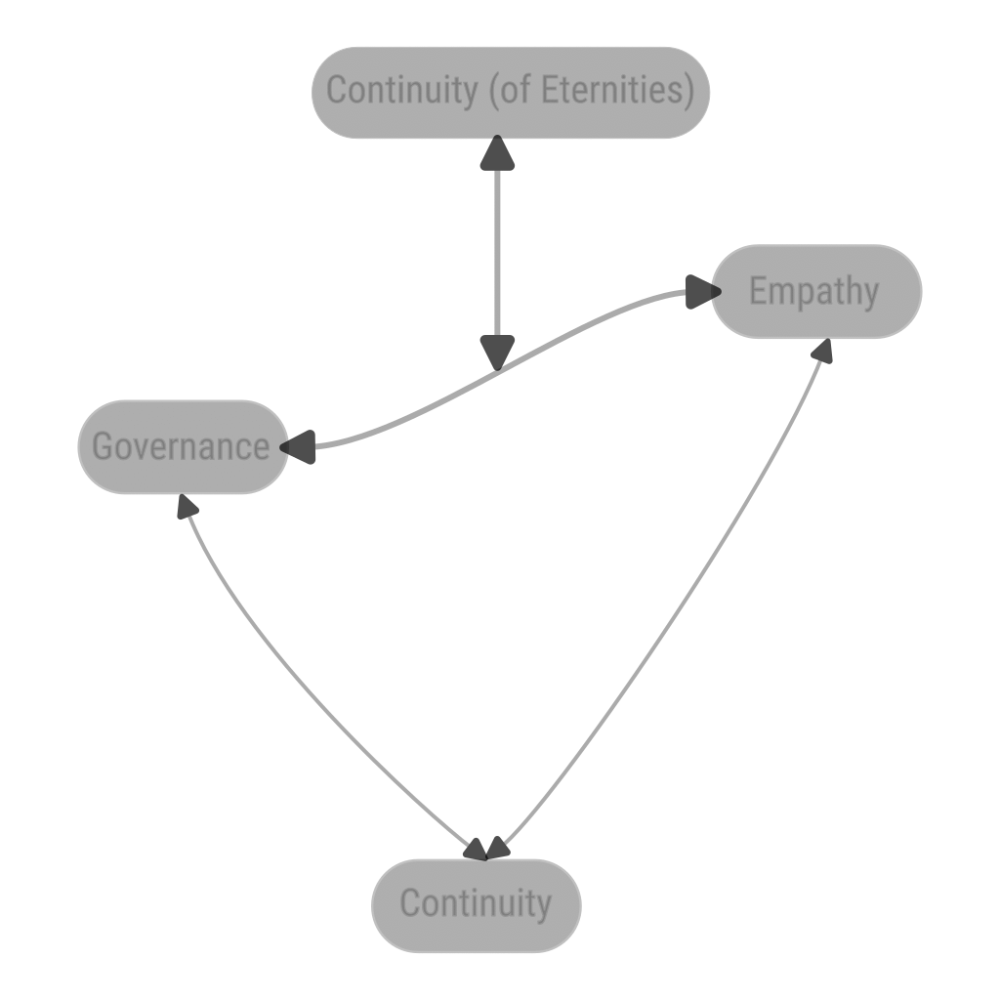

[back](./)

# Reduction of Virtues to 3 Moral Concepts

## The 3 Moral Concepts

- Empathy
- Governance
- Continuity: 
    - under Time: of life of the individual, of life of the species, of an emotion, of an idea
    - Timeless (Continuity of Eternities, of Causal relations): of institutions, of laws, of Concepts, Gods

## Application of Rule of Law

Rule of Law applied to:
- Empathy -> (social) Duties
- Governance -> (social) Rights
- Continuity -> (social) Contract

## Mentions

### In Classical Greek

"Avoid doing what you would blame others for doing." – Thales of Miletus (c. 624 – c. 546 BCE)

### In Zoroastrism

"That nature alone is good which refrains from doing to another whatsoever is not good for itself." Dadisten-I-dinik, 94,5
"Whatever is disagreeable to yourself do not do unto others." Shayast-na-Shayast 13:29

### In Hinduism

"One should never do something to others that one would regard as an injury to one's own self. In brief, this is dharma. Anything else is succumbing to desire." — Mahābhārata 13.114.8

### In Judaism

'You shall not take vengeance or bear a grudge against your kinsfolk. Love your neighbor as yourself: I am the LORD.' — Leviticus 19:18

‘What is hateful to thee, do not do until thy fellow man; this is the whole Law. The rest is commentary’ – Hillel the Elder, ca. 30 BCE – 10 CE

- חֶסֶד Ḥeseḏ, [chesed](https://en.wikipedia.org/wiki/Chesed), Love, Compassion

### In Christianity

"Do to others what you want them to do to you. This is the meaning of the law of Moses and the teaching of the prophets." — Matthew 7:12

"And as ye would that men should do to you, do ye also to them likewise" — Luke 6:31

"For all the law is fulfilled in one word, even in this; Thou shalt love thy neighbour as thyself." — Galatians 5:14

[Matthew 22:36-40](https://www.biblegateway.com/passage/?search=Matthew+22%3A36-40&version=NIV):

36. “Teacher, which is the greatest commandment in the Law?”
1. Jesus replied: “‘Love the Lord your God with all your heart and with all your soul and with all your mind.’
1. This is the first and greatest commandment.
1. And the second is like it: ‘Love your neighbor as yourself.’
1. All the Law and the Prophets hang on these two commandments.”

[1 Corinthians 13](https://www.biblegateway.com/passage/?search=1+Corinthians+13&version=NIV):

1. "If I speak in the tongues of men or of angels, but do not have love, I am only a resounding gong or a clanging cymbal. 
1. If I have the gift of prophecy and can fathom all mysteries and all knowledge, and if I have a faith that can move mountains, but do not have love, I am nothing. 
1. If I give all I possess to the poor and give over my body to hardship that I may boast, but do not have love, I gain nothing.

1. Love is patient, love is kind. It does not envy, it does not boast, it is not proud. 
1. It does not dishonor others, it is not self-seeking, it is not easily angered, it keeps no record of wrongs. 
1. Love does not delight in evil but rejoices with the truth. 
1. It always protects, always trusts, always hopes, always perseveres.

1. Love never fails. But where there are prophecies, they will cease; where there are tongues, they will be stilled; where there is knowledge, it will pass away. 
1. For we know in part and we prophesy in part, 
1. but when completeness comes, what is in part disappears. 
1. When I was a child, I talked like a child, I thought like a child, I reasoned like a child. When I became a man, I put the ways of childhood behind me. 
1. For now we see only a reflection as in a mirror; then we shall see face to face. Now I know in part; then I shall know fully, even as I am fully known.

1. And now these three remain: faith, hope and love. But the greatest of these is love."

- ἀγάπη agapē is translated as Love. It is possible to translate it more precisely as Empathy

### In Islam

"None of you [truly] believes until he wishes for his brother what he wishes for himself." — An-Nawawi's Forty Hadith 13

### In Buddhism

"Hurt not others in ways that you yourself would find hurtful" — Udanavarga 5:18
- [Muditā](https://en.wikipedia.org/wiki/Mudita): Empathy
- [Karuṇā](https://en.wikipedia.org/wiki/Karu%E1%B9%87%C4%81) for negative Golden Rule
- [Mettā/Maitrī](https://en.wikipedia.org/wiki/Maitr%C4%AB) for positive Golden Rule

### In Confucianism

'Zi Gong [a disciple of Confucius] asked: "Is there any one word that could guide a person throughout life?"
The Master replied: 
"How about 'shu' [reciprocity]: never impose on others what you would not choose for yourself?"' —Confucius, Analects XV.24

### In Taoism

"Regard your neighbor's gain as your own gain, and your neighbor's loss as your own loss." — T'ai Shang Kan Ying P'ien

### In Kant's Categorical Imperative

"Act only according to that maxim whereby you can at the same time will that it should become a universal law" — Immanuel Kant, Groundwork of the Metaphysics of Morals

### In Principle

Relations:
- doing to others: Governance
- useful or pleasurable or virtuous to me -> therefore to others: Empathy
- Empathy can be: 
  - towards your future self
  - towards Eternities (such as God)
  - towards others

## Dependencies of Virtues

## Relations between Concepts

## Relations between The 3 Concepts and Blockchain

1. Block Production
    1. Continuity
1. On-chain Governance and Voting: like Cosmos SDK governance 
    1. Governance
1. Block Validation, Data Availability: checking the validity of each block, sharing the data
    1. Empathy
1. Meta-Governance: Governance about the rules of Governance (available only on Mythos)
    1. Continuity of Eternities
