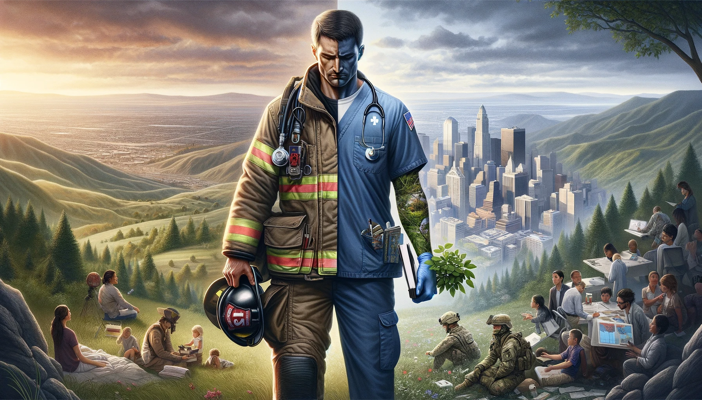

[back](./)

# Hero

## Requirements

- [being a volunteer](volunteer.html)

## Definitions

### Hero

- a person who displays courage, self-sacrifice, and integrity in the face of adversity, personal risk, or sacrifice to help others or achieve a greater good
- heroes cannot be imagined: their heroism depends upon a real risk

### Provable Hero

- a hero who can provide evidence or verification of the quality and quantity of their heroism

## Types

1. **Military Heroes**: Military volunteers who display valor and bravery in armed conflicts, risking their lives to protect their country and fellow soldiers.

2. **Civil Rights Heroes**: Volunteer activists who fight for social justice, equality, and human rights, facing opposition and danger to bring about change in society.

3. **Humanitarian Heroes**: People who dedicate their volunteering to helping others, such as aid workers, volunteers, and philanthropists, working in challenging and life-threatening conditions.

4. **Medical Heroes**: Healthcare volunteers, such as doctors, nurses, and researchers, who save lives and advance medical knowledge, working under extreme pressure or in crisis situations.

5. **Emergency Responder Heroes**: Volunteer firefighters, police officers, paramedics, and other emergency responders who risk their lives to protect and rescue people in dangerous situations.

6. **Environmental Heroes**: Individuals who advocate for and take action to protect the environment, combat climate change, and preserve natural resources and wildlife.

7. **Political Leaders**: Statespersons and leaders who make significant contributions to peace, democracy, and the welfare of their people, in the face of adversity or opposition.

8. **Everyday Heroes**: Ordinary people who perform extraordinary acts of kindness, courage, or selflessness in everyday life, without seeking recognition or reward.

9. **Cultural and Artistic Heroes**: Artists, writers, musicians, and cultural figures who inspire others, challenge norms, and contribute to societal change through their unpaid work and influence.

10. **Innovators and Pioneers**: Scientists, inventors, and entrepreneurs who volunteer groundbreaking discoveries, develop new technologies, and drive progress in various fields.

## Quality of Heroism

- Martyrs: those who sacrificed their lives in heroic action
- Heroes: those who have sacrificed some of their own non-renewable resources (great sums of money, one or more organs or functional parts of the body, important positions of dignity) to help others
- Volunteers: those who are helpful (donate their time and effort) but unpaid for their effort
- The Charitable: those who donate their hard-earned financial or renewable resources
- Mercenaries: those who are paid to act like a hero does and they perform the job: military, medical, civil servants, political representants
- The Money Launderers: those who donate to charities but have not earned the resources justly. Moral charities must research the money provenance and refuse immoral sources.
- Anti-Heroes: those who are paid to help others but do not perform their job or prevent heroes from performing their acts