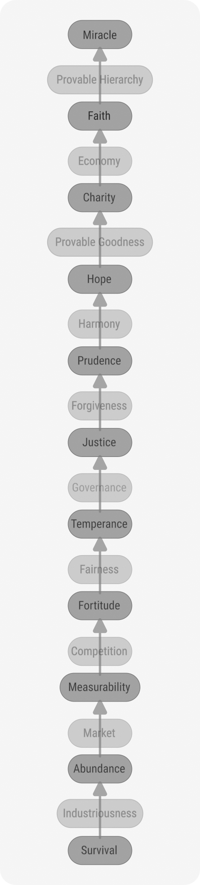

[back](./)

# Hierarchies

## The Default Hierarchy

The linking concepts are:

1. Provable Hierarchy
1. Provable Goodness
1. Harmony, Generosity, Humility, Recognition, Greatness, Gratitude, Nobility
    - humility means recognition of the virtue of others
    - humility means: upon public recognition of one's virtues, accepting the minimum that is merited
    - greatness is virtue, recognized by others
    - "noblesse oblige" means the duty to recognize the virtue of others when your virtues are recognized
    - false humility is of 3 types:
        - rejection of others' recognition of one's virtues (when the virtues are factual) is false
        - being humble without being recognized
        - assigning a different value to the concept of "humility" in the hierarchy than its earned value
1. Forgiveness/Repentance
    - takes place only after Justice has been imparted
    - Forgiveness is dependent upon signs of Repentance from the guilty party
    - this action is the essence of Orthodox Christianity: one cannot spiritually digest the Eucharist without Repentance for all wrongdoings and/or solving all injustices one is aware of
1. Governance
1. Fairness
1. Competition
1. Market
1. Industriousness

The default hierarchy is:

1. Faith, Reason
1. Provable Hierarchy
1. Charity
1. Provable Goodness
1. Hope
1. Harmony, Generosity
1. Prudence
1. Forgiveness
1. Justice
1. Governance
1. Temperance
1. Fairness
1. Fortitude
1. Competition
1. Measurability
1. Market
1. Abundance
1. Industriousness
1. Survival

## Links with Knowledge Domains

1. Faith, Reason
    - Mathematics
    - Philosophy
    - Physics
1. Provable Hierarchy
1. Charity
1. Provable Goodness
1. Hope
    - Education about Virtues
    - Ecology
1. Harmony, Generosity
1. Prudence
    - Education
1. Forgiveness
1. Justice
    - Jurisprudence
    - (Human) History
    - Juridic branch of Government
1. Governance
    - Administration
    - Legislative branch of Government
1. Temperance
    - Arts
    - Literature
    - Psychology
1. Fairness
    - Sociology
    - Civics
    - Charities
1. Fortitude
    - Sports
    - Military
    - Martial Arts
1. Competition
    - Searchability
    - Open Science Journals
    - Executive branch of Government
    - Games
    - Finance
    - Political Science
    - Mass Media
    - Marketing
1. Measurability
    - Programming
    - Automation
    - Management
    - Open Source
    - Open Data
    - AI
    - Geography
1. Market
    - Economy
    - Business
    - Marketing
1. Abundance
    - Industry
    - Chemistry
    - Energy Generation
1. Industriousness
    - Agriculture
    - Animal husbandry
1. Survival
    - Medicine
    - Biology

## Concerning Law

1. Omni Law
    - Faith
    - Provable Hierarchy
    - Charity
    - Provable Goodness

    the individual is the whole life
1. Contractual Law (not business contract law)
    - Hope
    - Harmony
    - Prudence
    - Forgiveness

    the individual uses the community for general goodness
1. Civil Law
    - Justice
    - Governance
    - Temperance
    - Fairness

    the individual uses the community for community profit
1. Criminal Law
    - Fortitude
    - Competition
    - Market

    the individual uses the community for self profit
1. Natural Law
    - Abundance
    - Industriousness
    - Survival

    the individual (or nuclear family) lives alone: no community

## Chakras

1. [Sahasrara](https://en.wikipedia.org/wiki/Sahasrara)
    - (beyond concepts)
1. [Ajna](https://en.wikipedia.org/wiki/Ajna)
    - Faith, Reason
    - Provable Hierarchy
1. [Vishuddha](https://en.wikipedia.org/wiki/Vishuddha)
    - Charity
    - Provable Goodness
    - Hope
    - Harmony, Generosity
    - Prudence
    - Forgiveness
1. [Anahata](https://en.wikipedia.org/wiki/Anahata)
    - Justice
    - Governance
    - Temperance
    - Fairness
1. [Manipura](https://en.wikipedia.org/wiki/Manipura)
    - Fortitude
    - Competition
    - Measurability
1. [Svadhishthana](https://en.wikipedia.org/wiki/Svadhisthana)
    - Market
    - Abundance
1. [Muladhara](https://en.wikipedia.org/wiki/Muladhara)
    - Industriousness
    - Survival
