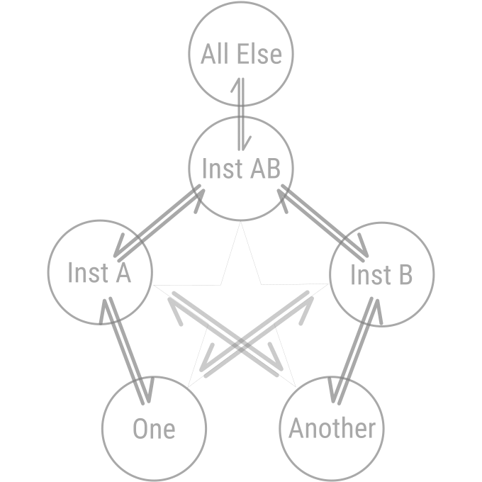

[back](./)

# Relationship

A relationship is a double transaction between One, Another, and All Else.

If a double transaction is between One and Another and it exchanges one higher virtue (higher than Idealism/Fortitude) for another, we may call this ideal friendship.

Now let us explore the virtuous relationships from the point of view of One:

- One gives (some quantity of virtue) to Another:
    - receives (same) from Another: Friendship, Trade Relation and, low to high:
        - all paid professions
        - (Fair) Competitor
        - Romantic relation
        - Marriage
        - Parenting
        - Extended family relations
        - Being a student and teacher on a lineage
        - Using the internet/AI: accepting to consume ads, having your content be used by the AI
        - Ideal Friendship
    - receives from All Else: Benefactor (to Another) volunteer:
        - Medic
        - Militiaman
        - Witness/Whistleblower
        - Parent
        - Teacher
        - Artist
        - Journalist
        - Mentor
        - Researcher/Developer
        - Priest
        - Hero
        - [Bodhisattva](https://en.wikipedia.org/wiki/Bodhisattva)

- One gives to All Else:
    - receives from Another: [Mendicant](https://en.wikipedia.org/wiki/Mendicant)
    - receives from All Else: [Hermit](https://en.wikipedia.org/wiki/Hermit)

- Another gives to and receives from All Else: no relationship

## Hope and Loyalty are the Differentiators

Between virtues:

### Timeless Virtues

1. Faith, Reason
1. Provable Hierarchy
1. Charity
1. Provable Goodness
1. Hope
    1. Sacrifice to Timelessness

### Human Virtues

1. Hope
    1. Sacrifice for Civility
    1. Education (unpaid)
1. Harmony, Generosity
1. Prudence
1. Forgiveness
1. Justice
1. Governance
1. Temperance
1. Fairness
1. Fortitude
    1. Loyalty to ideals/Idealism
    2. Loyalty to Another

### Animal Virtues

1. Fortitude
    1. Loyalty to Another
    1. Fortitude for the sake of personal Survival, Abundance, Recognition
1. Competition
4. Measurability
5. Market
6. Abundance
7. Industriousness
8. Survival

## Vicious Relationships

- that do not implement the double transaction rule (thus being unsustainable or unfair)
- those that use vices as a transactional currency
- those that decrease the clarity and awareness of the relationship mechanics

## Hierarchy

Concerning virtues and vices, we can construct a hierarchy of relationships:

1. Ideal Friendship
2. Being a student and teacher in a spiritual lineage
3. Benefactor (see the types above)
4. Friendship (see the types above)
5. Marriage
6. Trade relation (see the types above)
7. Fair competitor
8. Mendicant
9. Hermit
10. No relationship
11. Pretended relationship / lack of clarity about the nature of the relationship
12. Peer pressure conformer
13. Peer pressure initiator
15. Beggar
14. Unfair competitor, enemy
15. Thief
15. Emotional manipulator/abuser
16. Initiator into vices
17. Robber
18. Traitor to One's resources
19. Physical torturer
20. Inflicting to One's body irreversible functional damage
21. Traitor to One's ideals
22. Assasin
23. Manipulator of proofs and history (about killing Another)
24. Manipulator of virtues (definitions, hierarchy)
25. Anti-Friendship: "friendship" that uses vices as a transaction currency

## Virtue -> Relation

## Relation -> Virtue

## Proposed Relationship

Inst A is Institution A or Social Contract A. Inst AB is the Contract that can operate transactions between Institution A and Institution B: their higher contractual authority.

If Virtues are encoded in the social contracts explicitly and the encoding is upgradeable, the civilization has improved chances for evolution as a whole.