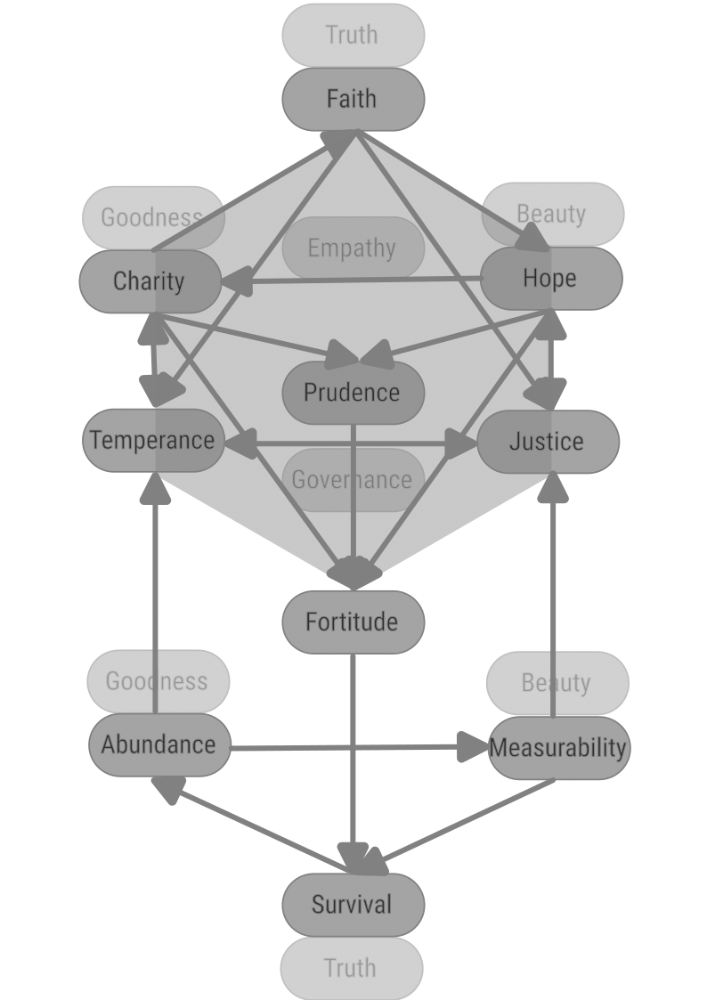
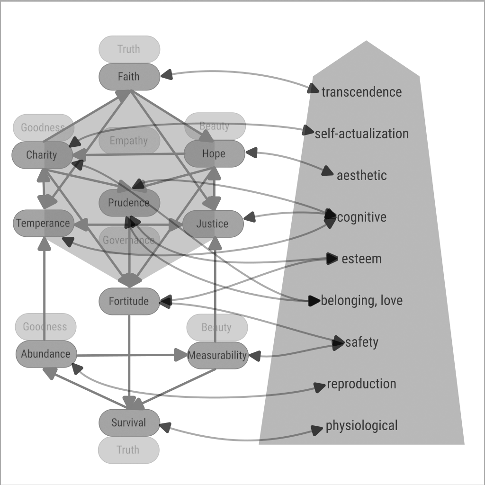
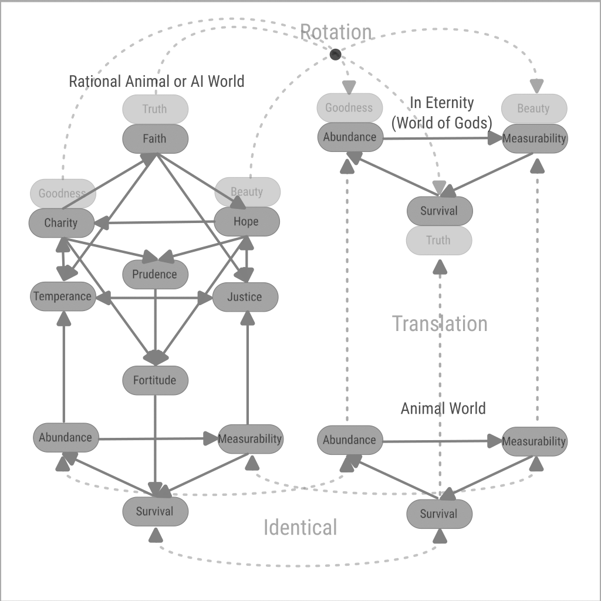

[back](./)

# Virtues

## Definition

Virtues are not only qualitative concepts, they are quantitative. Because a perfection is not only characterized by quality, but also by quantity. Or: both quality and quantity have their own perfection and the common perfection is found at the intersection of the respective perfections.

We will name the lacking or the excess in each quality as Vices, and the mean as Virtues.

Qualitatively, a virtue has to be considered using the following criteria:
1. Has to be as atomic as possible.
1. To have a constructive dependence:
    1. To not diminish other virtues.
    1. To compose positively with other virtues (addition).
    1. To have synergy with other virtues (composition that values more than simple addition).
1. To have a dimension of measure where it occupies a mid-range. And the extremes are less moral.
1. On the dimension of measure: lack or be in excess in most cases.
1. To exist at some point instantated by some human.
1. To not exist for some human.
1. To exist in a group of humans, institution.
1. To have a name, concept, signifier, ritualistic act, or artistic depiction.

Quantitatively, we accept these definitions of virtue:
1. A range of values that are more beneficial than ranges smaller or greater.
1. A point in that range that maximizes the benefit according to the dimension of that virtue.
1. A point in that range that maximizes the benefit according to all virtues.

## The Ranges

| No | Dimensions\Ranges | Lacking | Mean | Excess |
|----|-------------------|---------|------|--------|
|  1 | Proof beyound reason | Trick |[Miracle](miracle.md) | Magic |
|  2 | Orderliness | Inability to Rank | [Provable Order/Hierarchy](order.md)| Rigidity |
|  3 | Truth Acceptance |Cinicism| [Faith, Reason](faith.md) | Credulity |
|  4 | Management of Goodness | No Management | [Economy](economy.md) | Accounting too strictly |
|  5 | Investing in Others | Begging | [Charity](charity.md) | Extravagance of Generosity |
|  6 | Investing Virtue | nothing to invest or attachement | [Goodness, Sacrifice, Courage, Civilization](goodness.md) | invest more than can be received |
|  7 | Will to Evolve| Pessimism | [Hope](hope.md) | Ungrounded Idealism |
|  8 | Harmony | lack of Harmony | [Harmony, Generosity](harmony.md) | Ritualistic Generosity |
|  9 | Strategy | Unpreparedness | [Prudence](prudence.md) | Rigidity, Inability to take risks |
| 10 | Act when wrong | not forgive | [Forgiveness](forgiveness.md) | Forgive more than should / be Unjust |
| 11 | Righteousness | Relativism | [Justice](justice.md) | Sadism |
| 12 | Governance of others | Anarchy | [Governance](governance.md) | Tyrany |
| 13 | Self-Governance | Hedonism | [Temperance](temperance.md) | Unsustainable Asceticism |
| 14 | Conditions of contest | Abuse | [Fairness](fairness.md) | being Unjust |
| 15 | Willpower | Spineless | [Fortitude](fortitude.md) | Imposition, Rashness |
| 16 | Contest | lack of Competition | [Competition](competition.md) | Violence, Pointless competition |
| 17 | Reality Perception | Blind or unwilling to know or compete | [Measurability](measurability.md) | Detailed knowledge without reason|
| 18 | Transparence | under the counter | [Market](market.md) | All is tradeable |
| 19 | Wealth, Vitality | Poverty/Lazyness | [Abundance](abundance.md) | Abundance without reason |
| 20 | Thrive | lack of effort | [Industriousness](industriousness.md) | Reflex, one size fits all |
| 21 | Life | Extinction | [Survival](survival.md) | Canibalism/Stealing |

## Dependencies

## Relation to Needs

## The Worlds Governed

## Islam

1. Tawheed (Belief in the Oneness of God): The most fundamental Islamic virtue, it encompasses complete faith in the oneness and sovereignty of Allah.
    1. Faith, Clarity
1. Adl (Justice): Acting justly and ensuring fairness and equity is a central tenet in Islam. It is not just a moral virtue but also an obligation in all aspects of life.
    1. Justice
1. Ihsan (Benevolence/Excellence): This virtue means to do things with perfection, beauty, and excellence, and to act benevolently. It also involves being conscious of God at all times.
    1. Charity
    1. Hope
1. Sabr (Patience): Highly valued, patience in the face of hardship, and perseverance in adhering to righteous behavior are considered essential.
    1. Fortitude
1. Shukr (Gratitude): Being grateful to Allah for His blessings is a key virtue. Gratitude is expressed through prayer, praise, and conduct.
    1. Hope
1. Rahmah (Mercy and Compassion): Mercy, as exemplified by the Prophet Muhammad, is a central virtue. Muslims are encouraged to show compassion and kindness to all of God's creations.
    1. Charity
1. Sadaqah (Charitable Giving): Beyond obligatory almsgiving (Zakat), voluntary charity is highly commended, reflecting compassion and generosity.
    1. Charity
1. Tawbah (Repentance): Continually seeking forgiveness from Allah and turning away from sin are fundamental aspects of Islamic virtue.
    1. Hope
1. Taqwa (God-consciousness/Piety): This encompasses being aware of God in all aspects of one’s life, obeying His commands, and avoiding His prohibitions.
    1. Faith
1. Haya (Modesty and Humility): It involves modesty not just in dress and behavior but also in attitude, promoting humility and decency.
    1. Prudence
1. Amanah (Trustworthiness): Being reliable and trustworthy in all affairs, including both personal and communal matters.
    1. Justice
1. Ilm (Knowledge and Wisdom): Seeking knowledge is considered an act of worship in Islam. Wisdom in using this knowledge is also highly valued.
    1. Prudence
1. Akhlaq (Good Character and Manners): The Prophet Muhammad placed great emphasis on good character, kindness, forgiveness, and courtesy in interactions.
    1. Temperance

## Christianity

1. Theological Virtues
    1. Faith: Complete trust in God and acceptance of God's will.
        1. Faith
    1. Hope: Expectation of and longing for the fulfillment of God's promises.
        1. Hope
    1. Love (Agape): Unconditional love that emulates the love of Christ for humanity.
        1. Charity
1. Cardinal Virtues
    1. Prudence (Wisdom): Insight and wisdom in dealing with complex issues, discernment.
        1. Prudence
        1. Faith, Clarity of Implication
    1. Justice: Fairness and righteousness in one's actions.
        1. Justice
    1. Fortitude (Courage): Strength and courage to face trials and challenges.
        1. Fortitude
    1. Temperance: Self-control and moderation in all things.
        1. Temperance
1. Christian-specific:
    1. Humility: Often considered the greatest virtue in Orthodoxy, humility is the foundation of a true Christian life.
        1. Faith
        1. Temperance
    1. Repentance: A continuous process of self-examination and turning towards God.
        1. Justice
        1. Fortitude
    1. Asceticism: Practicing self-denial to focus more fully on the spiritual life, often expressed through fasting, prayer, and almsgiving.
        1. Fortitude
        1. Hope
    1. Hospitality: Emphasis on caring for others, especially strangers and those in need.
        1. Charity
    1. Obedience: Especially in monastic contexts, obedience to spiritual elders is seen as a path to humility and spiritual growth.
        1. Faith

## Judaism

1. Tzedakah (Righteousness/Charity): Often translated as charity, tzedakah is more broadly the concept of justice and righteousness achieved through acts of kindness and giving.
    1. Charity
    1. Justice
1. Chesed (Loving-kindness): This virtue is fundamental in Jewish ethics, emphasizing compassion and love for others, and is considered a central attribute of God.
    1. Charity
1. Emunah (Faith or Trust in God): This entails a deep and abiding faith in God, often seen as faithfulness to God's covenant.
    1. Hope
1. Shalom (Peace): Shalom goes beyond the absence of conflict and encompasses completeness, welfare, and harmony in all aspects of life.
    1. Temperance
1. Teshuvah (Repentance): This is a process of acknowledging one's sins before God, seeking forgiveness, and committing to change one's behavior.
    1. Justice
1. Kavod (Honor/Respect): Showing respect for the inherent dignity of all people is a key virtue in Judaism.
    1. Temperance
1. Ahavat Torah (Love of the Law/Torah): This refers to the love and study of the Torah and its teachings.
    1. Faith, Clarity of Implication
1. Savlanut (Patience): Bearing adversity and insult without bitterness or complaint is considered a virtue in Jewish thought.
    1. Prudence
1. Anavah (Humility): Humility is seen as recognizing one's place in the world relative to God and others.
    1. Harmony, Humility
1. Emet (Truthfulness): Honesty and integrity in one's words and actions are highly valued.
    1. Faith
1. Kedushah (Holiness): Striving for a life of holiness, often through following the commandments (mitzvot) and engaging in acts that draw one closer to God.
    1. Fortitude

## Correspondence with Buddhist Pāramitā

1. Dāna (pāramī): generosity, giving of oneself
    1. Harmony, Humility
1. Sīla: virtue, morality, proper conduct
    1. Prudence
1. Nekkhamma: renunciation
    1. Fortitude
    1. Prudence
1. Paññā: wisdom, discernment
    1. Justice
1. Viriya: energy, diligence, vigour, effort
    1. Fortitude
1. Khanti: patience, tolerance, forbearance, acceptance, endurance
    1. Temperance
    1. Fortitude
1. Sacca: truthfulness, honesty
    1. Faith, Clarity
1. Adhiṭṭhāna: determination, resolution
    1. Fortitude
1. Mettā: goodwill, friendliness, loving-kindness
    1. Hope
1. Upekkhā: equanimity, serenity
    1. Faith, Clarity
    1. Temperance

## Correspondence with Hindu Yamas and Niyamas

1. Yamas:
    1. Ahiṃsā (अहिंसा): Nonviolence
        1. Temperance
    1. Satya (सत्य): Truthfulness (Not lying)
        1. Faith, Clarity
        1. Temperance
    1. Asteya (अस्तेय): Not stealing
        1. Temperance
        1. Abundance
    1. Brahmacharya (ब्रह्मचर्य): Chastity, marital fidelity, sexual restraint
        1. Hope
        1. Temperance
    1. Aparigraha (अपरिग्रहः): Non-avarice, non-possessiveness
        1. Charity
        1. Prudence
1. Niyamas:
    1. Shaucha (शौच): purity, clearness of mind, speech and body
        1. Prudence
    1. Santosha (सन्तोष): contentment, acceptance of others and of one's circumstances as they are, optimism for self
        1. Temperance
    1. Tapas (तपस्): austerity, self-discipline, persistent meditation, perseverance
        1. Fortitude
    1. Svadhyaya (स्वाध्याय): study of self, self-reflection, introspection of self's thoughts, speeches and actions
        1. Justice
    1. Ishvarapranidhana (ईश्वरप्रणिधान): contemplation of the Ishvara (God/Supreme Being, Brahman, True Self, Unchanging Reality), attunement to the supreme consciousness
        1. Faith

## Classical Greek Virtues

1. Arete: "excellence", "virtue". It signifies the fulfillment of purpose or function: the act of living up to one's full potential.
    1. Fortitude
    1. Hope (fulfilled)
1. Sophia (Wisdom): Valued highly by philosophers like Socrates, Plato, and Aristotle, wisdom is the ability to think and act using knowledge, experience, understanding, common sense, and insight.
    1. Justice
    2. Prudence
1. Dikaiosyne (Justice): More than just legal justice, this virtue was about behaving in a way that is morally right and fair towards others.
    1. Justice
1. Andreia (Courage): Not just physical bravery, but also the inner strength to stand up for what is right and to face challenges, fears, and difficulties.
    1. Fortitude
1. Sophrosyne (Temperance/Moderation): This virtue represents self-control, moderation, and the balanced life. It was considered essential for achieving harmony and avoiding excess.
    1. Temperance
1. Phronesis (Practical Wisdom/Prudence): This involves not only wisdom but the ability to act based on that wisdom. It's about making the right decisions in practical matters.
    1. Prudence
1. Eunoia (Goodwill towards others): It encompasses the idea of trustworthiness and kindness in dealings with other people.
    1. Charity
1. Xenia (Hospitality): Highly praised and embedded in Greek custom, xenia is the generosity and courtesy shown to those who are far from home.
    1. Charity

## Taoist Virtues

1. Wú-wéi (無為, Effortless Action or Non-Action): This is the concept of taking action that is in harmony with the flow of the Tao, characterized by naturalness and spontaneity. It means not forcing or struggling against the natural order of things.
    1. Justice
1. Ziran (自然, Naturalness or Spontaneity): Ziran refers to being natural, spontaneous, and authentic, acting in accordance with one's true nature and the nature of the world, without artificiality or compulsion.
    1. Fortitude
1. Simplicity (樸, Pu): Valued highly in Taoism, simplicity means leading a life that is plain and unadorned, free from unnecessary complications and desires. It involves being content with little and finding joy in simple things.
    1. Prudence
1. Humility (謙, Qian): Recognizing one's small place in the vastness of the universe and approaching life with modesty and humility.
    1. Harmony, Humility
1. Compassion (慈, Ci): Showing kindness and consideration towards all beings, understanding that all life is interconnected.
    1. Charity
1. Moderation (中庸, Zhong Yong): Advocating for a balanced, moderate approach to life, avoiding extremes, and maintaining equilibrium.
    1. Temperance
1. Harmony (和, He): Living in harmony with oneself, with others, and with the natural world. This involves understanding and adapting to the rhythms and patterns of nature.
    1. Harmony, Humility
1. Patience (忍, Ren): Understanding and accepting the natural course of things, which involves enduring hardships and setbacks with a calm and peaceful mind.
    1. Faith

## Confucianism

1. Primary:
    1. Ren (仁, Benevolence or Humaneness): Often considered the supreme virtue in Confucianism, ren is the quality of compassion, kindness, and empathy towards others. It's about caring for people and is central to Confucian ethics.
        1. Empathy: 
            - Faith, Reason
            - Charity
            - Hope
            - Prudence
            - Temperance
            - Justice
            - Governance
    1. Yi (義, Righteousness or Justice): Yi is the moral disposition to do good, and the ability to recognize what is right and just. It involves putting moral principles into practice.
        1. Justice
    1. Li (禮, Proper Ritual or Etiquette): This virtue refers to a set of rituals, customs, and standards of politeness that govern proper behavior and maintain social order. It's about showing respect through appropriate conduct.
        1. Fortitude, Fitness
    1. Zhi (智, Wisdom): Zhi is the ability to judge and act wisely. It involves a deep understanding of people and situations, and the application of knowledge in a practical and ethical manner.
        1. Prudence
1. Major:
    1. Jié (节; 節, Continence): self-control, especially in the context of desires and impulses
        1. Temperance
    1. Xin (信, Integrity or Trustworthiness): Xin emphasizes honesty, reliability, and faithfulness. It's about being true to one's word and maintaining trust in relationships.
        1. Charity
    1. Xiao (孝, Filial Piety): This virtue represents respect, obedience, and care for one's parents and ancestors. It's a key aspect of family values in Confucianism.
        1. Composed
    1. Zhong (忠, Loyalty): Loyalty in Confucianism involves being faithful to one’s superiors, friends, and the principles of ren and yi.
        1. Loyalty, Fortitude
    1. Shù (恕, Reciprocity or Empathy): Often described as the "Golden Rule" of Confucianism, shu involves treating others as one would wish to be treated.
        1. Empathy
    1. Wēn (文, Cultural Refinement): Wen refers to the appreciation and cultivation of arts, literature, and culture, which are seen as important for personal development and social refinement.
        1. Harmony, Nobility
1. Minor:
    1. honesty (诚; chéng)
        1. Faith
    1. bravery (勇; yǒng)
        1. Fortitude
    1. incorruptibility (廉; lián)
        1. Faith
    1. sense of right and wrong (耻; chǐ)
        1. Justice
    1. kindheartenedness (良; liáng)
        1. Hope
    1. respect (恭; gōng)
        1. Faith
    1. frugality (俭; jiǎn)
        1. Temperance
        1. Fortitude
    1. modesty (让; ràng)
        1. Prudence