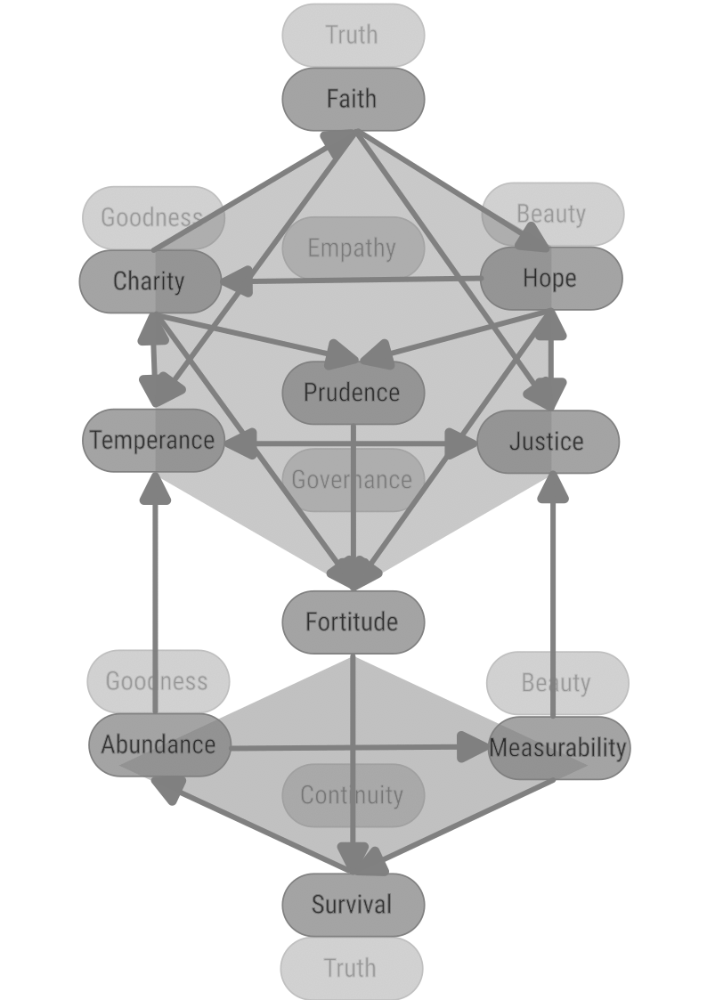
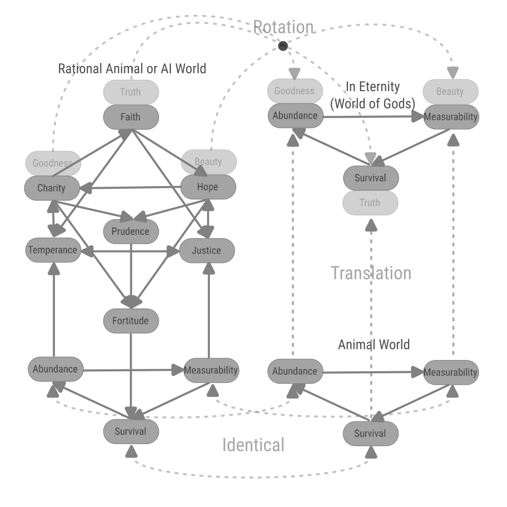

[back](./)

# Virtues

## Definition

Virtues are not only qualitative concepts, they are quantitative. Because a perfection is not only characterized by quality, but also by quantity. Or: both quality and quantity have their own perfection and the common perfection is found at the intersection of the respective perfections.

We will name the lacking or the excess in each quality as Vices, and the mean as Virtues.

| Dimension\Ranges | Lacking | Mean | Excess |
|------------------|---------|------|--------|
| Truth Acceptance |Cinicism| Faith, Clarity of Implication | Credulity |
| Effort Making | Beggar | Charity | Extravagance of Generosity |
| Will to Evolve| Pessimism | Hope | Ungrounded Idealism |
| Self-Governance | Hedonism | Temperance | Unsustainable Asceticism |
| Strategy | Unpreparedness | Prudence | Rigidity, Inability to take risks |
| Righteousness | Relativism | Justice | Sadism |
| Willpower, Courage | Spineless | Fortitude | Imposition, Rashness |
| Reality Perception | Blind or unwilling to know or compete | Measurability, Competition | Detailed knowledge without reason, Pointless competition|
| Wealth, Vitality | Poverty/Lazyness | Abundance | Abundance without reason |
| Life | Non-existence | Survival | Canibalism/Stealing |

## Dependencies

## Relation to Needs

## The Worlds Governed

## Islam

1. Tawheed (Belief in the Oneness of God): The most fundamental Islamic virtue, it encompasses complete faith in the oneness and sovereignty of Allah.
    1. Faith, Clarity
1. Adl (Justice): Acting justly and ensuring fairness and equity is a central tenet in Islam. It is not just a moral virtue but also an obligation in all aspects of life.
    1. Justice
1. Ihsan (Benevolence/Excellence): This virtue means to do things with perfection, beauty, and excellence, and to act benevolently. It also involves being conscious of God at all times.
    1. Charity
    1. Hope
1. Sabr (Patience): Highly valued, patience in the face of hardship, and perseverance in adhering to righteous behavior are considered essential.
    1. Fortitude
1. Shukr (Gratitude): Being grateful to Allah for His blessings is a key virtue. Gratitude is expressed through prayer, praise, and conduct.
    1. Hope
1. Rahmah (Mercy and Compassion): Mercy, as exemplified by the Prophet Muhammad, is a central virtue. Muslims are encouraged to show compassion and kindness to all of God's creations.
    1. Charity
1. Sadaqah (Charitable Giving): Beyond obligatory almsgiving (Zakat), voluntary charity is highly commended, reflecting compassion and generosity.
    1. Charity
1. Tawbah (Repentance): Continually seeking forgiveness from Allah and turning away from sin are fundamental aspects of Islamic virtue.
    1. Hope
1. Taqwa (God-consciousness/Piety): This encompasses being aware of God in all aspects of one’s life, obeying His commands, and avoiding His prohibitions.
    1. Faith
1. Haya (Modesty and Humility): It involves modesty not just in dress and behavior but also in attitude, promoting humility and decency.
    1. Prudence
1. Amanah (Trustworthiness): Being reliable and trustworthy in all affairs, including both personal and communal matters.
    1. Justice
1. Ilm (Knowledge and Wisdom): Seeking knowledge is considered an act of worship in Islam. Wisdom in using this knowledge is also highly valued.
    1. Justice
1. Akhlaq (Good Character and Manners): The Prophet Muhammad placed great emphasis on good character, kindness, forgiveness, and courtesy in interactions.
    1. Temperance

## Judaism

1. Tzedakah (Righteousness/Charity): Often translated as charity, tzedakah is more broadly the concept of justice and righteousness achieved through acts of kindness and giving.
    1. Charity
    1. Justice
1. Chesed (Loving-kindness): This virtue is fundamental in Jewish ethics, emphasizing compassion and love for others, and is considered a central attribute of God.
    1. Charity
1. Emunah (Faith or Trust in God): This entails a deep and abiding faith in God, often seen as faithfulness to God's covenant.
    1. Hope
1. Shalom (Peace): Shalom goes beyond the absence of conflict and encompasses completeness, welfare, and harmony in all aspects of life.
    1. Temperance
1. Teshuvah (Repentance): This is a process of acknowledging one's sins before God, seeking forgiveness, and committing to change one's behavior.
    1. Justice
1. Kavod (Honor/Respect): Showing respect for the inherent dignity of all people is a key virtue in Judaism.
    1. Temperance
1. Ahavat Torah (Love of the Law/Torah): This refers to the love and study of the Torah and its teachings.
    1. Faith, Clarity of Implication
1. Savlanut (Patience): Bearing adversity and insult without bitterness or complaint is considered a virtue in Jewish thought.
    1. Prudence
1. Anavah (Humility): Humility is seen as recognizing one's place in the world relative to God and others.
    1. Justice
1. Emet (Truthfulness): Honesty and integrity in one's words and actions are highly valued.
    1. Faith
1. Kedushah (Holiness): Striving for a life of holiness, often through following the commandments (mitzvot) and engaging in acts that draw one closer to God.
    1. Fortitude

## Correspondence with Buddhist Pāramitā

1. Dāna (pāramī): generosity, giving of oneself
    1. Charity
1. Sīla: virtue, morality, proper conduct
    1. Prudence
1. Nekkhamma: renunciation
    1. Fortitude
    1. Prudence
1. Paññā: wisdom, discernment
    1. Justice
1. Viriya: energy, diligence, vigour, effort
    1. Fortitude
1. Khanti: patience, tolerance, forbearance, acceptance, endurance
    1. Temperance
    1. Fortitude
1. Sacca: truthfulness, honesty
    1. Faith, Clarity
1. Adhiṭṭhāna: determination, resolution
    1. Fortitude
1. Mettā: goodwill, friendliness, loving-kindness
    1. Hope
1. Upekkhā: equanimity, serenity
    1. Temperance

## Correspondence with Hindu Yamas and Niyamas

1. Yamas:
    1. Ahiṃsā (अहिंसा): Nonviolence
        1. Temperance
    1. Satya (सत्य): Truthfulness (Not lying)
        1. Faith, Clarity
    1. Asteya (अस्तेय): Not stealing
        1. Temperance
        1. Abundance
    1. Brahmacharya (ब्रह्मचर्य): Chastity, marital fidelity, sexual restraint
        1. Hope
        1. Temperance
    1. Aparigraha (अपरिग्रहः): Non-avarice, non-possessiveness
        1. Charity
        1. Prudence
1. Niyamas:
    1. Shaucha (शौच): purity, clearness of mind, speech and body
        1. Prudence
    1. Santosha (सन्तोष): contentment, acceptance of others and of one's circumstances as they are, optimism for self
        1. Temperance
    1. Tapas (तपस्): austerity, self-discipline, persistent meditation, perseverance
        1. Fortitude
    1. Svadhyaya (स्वाध्याय): study of self, self-reflection, introspection of self's thoughts, speeches and actions
        1. Justice
    1. Ishvarapranidhana (ईश्वरप्रणिधान): contemplation of the Ishvara (God/Supreme Being, Brahman, True Self, Unchanging Reality), attunement to the supreme consciousness
        1. Faith

## Classical Greek Virtues

1. Arete: "excellence", "virtue". It signifies the fulfillment of purpose or function: the act of living up to one's full potential.
    1. Fortitude
    1. Hope (fulfilled)
1. Sophia (Wisdom): Valued highly by philosophers like Socrates, Plato, and Aristotle, wisdom is the ability to think and act using knowledge, experience, understanding, common sense, and insight.
    1. Faith
    2. Justice
1. Dikaiosyne (Justice): More than just legal justice, this virtue was about behaving in a way that is morally right and fair towards others.
    1. Justice
1. Andreia (Courage): Not just physical bravery, but also the inner strength to stand up for what is right and to face challenges, fears, and difficulties.
    1. Fortitude
1. Sophrosyne (Temperance/Moderation): This virtue represents self-control, moderation, and the balanced life. It was considered essential for achieving harmony and avoiding excess.
    1. Temperance
1. Phronesis (Practical Wisdom/Prudence): This involves not only wisdom but the ability to act based on that wisdom. It's about making the right decisions in practical matters.
    1. Prudence
1. Eunoia (Goodwill towards others): It encompasses the idea of trustworthiness and kindness in dealings with other people.
    1. Charity
1. Xenia (Hospitality): Highly praised and embedded in Greek custom, xenia is the generosity and courtesy shown to those who are far from home.
    1. Charity

