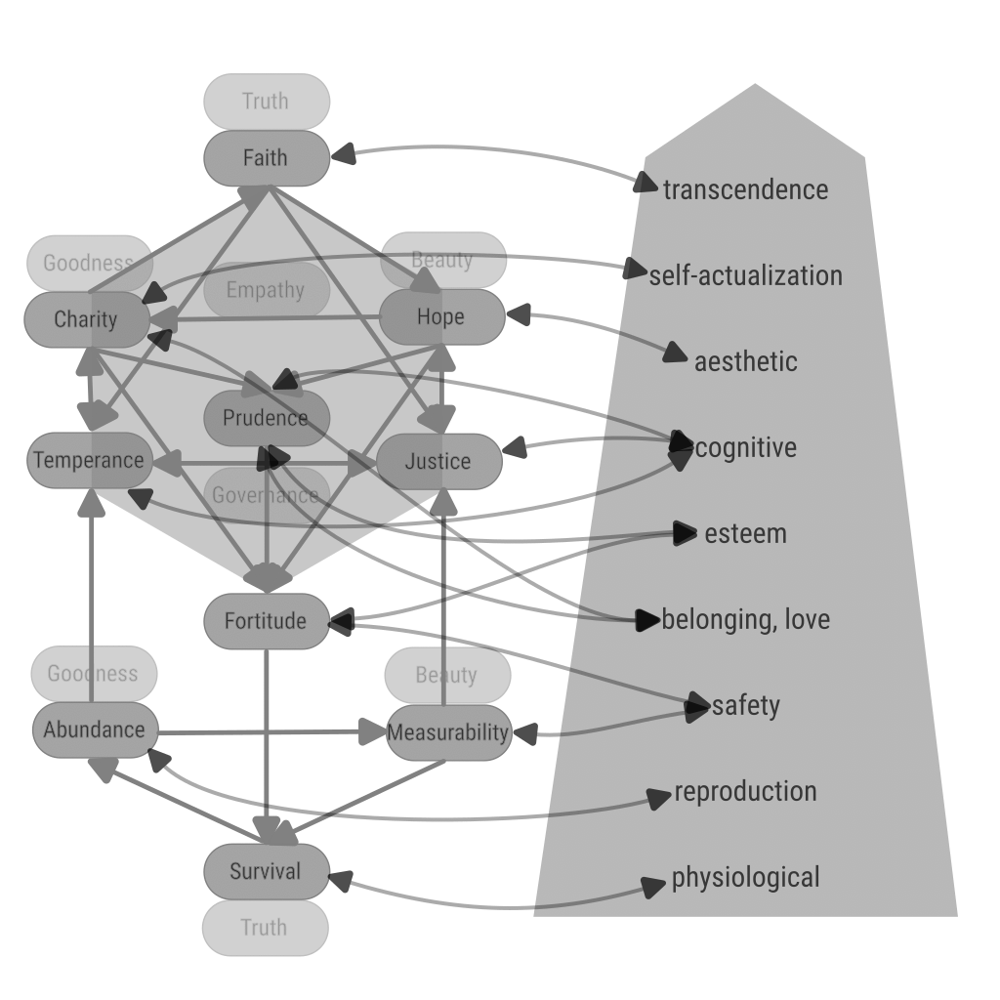

[back](./)

# Virtues

## Definition

Virtues are not only qualitative concepts, they are quantitative. Because a perfection is not only characterized by quality, but also by quantity. Or: both quality and quantity have their own perfection and the common perfection is found at the intersection of the respective perfections.

We will name the lacking or the excess in each quality as Vices, and the mean as Virtues.

| Dimension\Ranges | Lacking | Mean | Excess |
|------------------|---------|------|--------|
| Truth Acceptance |Cinicism| Faith | Credulity |
| Effort Making | Beggar | Charity | Extravagance of Generosity |
| Will to Evolve| Pessimism | Hope | Ungrounded Idealism |
| Self-Governance | Hedonism | Temperance | Unsustainable Asceticism |
| Strategy | Unpreparedness | Prudence | Rigidity, Inability to take risks |
| Righteousness | Relativism | Justice | Sadism |
| Willpower, Courage | Spineless | Fortitude | Imposition, Rashness |
| Reality Perception | Blind or unwilling to know or compete | Measurability, Competition | Detailed knowledge without reason, Pointless competition|
| Wealth, Vitality | Poverty/Lazyness | Abundance | Abundance without reason |
| Life | Non-existence | Survival | Canibalism/Stealing |

## Dependencies

## Relation to Needs

## The Worlds Governed

